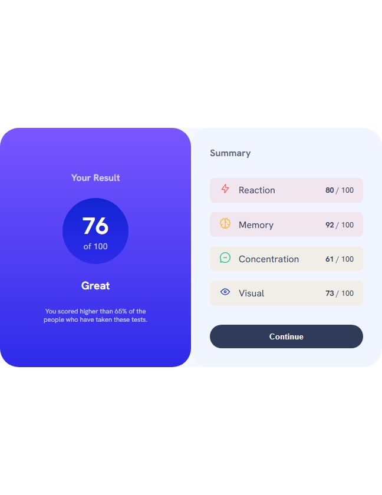
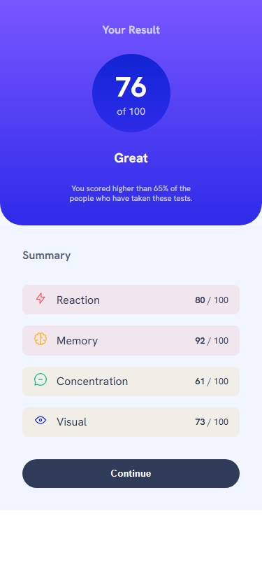

# Frontend Mentor - Results summary component solution

This is a solution to the [Results summary component challenge on Frontend Mentor](https://www.frontendmentor.io/challenges/results-summary-component-CE_K6s0maV). Frontend Mentor challenges help you improve your coding skills by building realistic projects.

## Table of contents

- [Overview](#overview)
  - [The challenge](#the-challenge)
  - [Screenshot](#screenshot)
- [My process](#my-process)
  - [Built with](#built-with)
  - [What I learned](#what-i-learned)
  - [Continued development](#continued-development)
- [Author](#author)

## Overview

### The challenge

Users should be able to:

- View the optimal layout for the interface depending on their device's screen size
- See hover and focus states for all interactive elements on the page
- **Bonus**: Use the local JSON data to dynamically populate the content

### Screenshot

Above 992px

Between 600px and 992px

Between 375px and 600px

 

### Built with

- Semantic HTML5 markup
- CSS custom properties
- Flexbox
- Mobile-first workflow

### What I learned

I learned ang got a recap on the major concept of css flexbox which was frequently used in this challenge

### Continued development

I would like to focus on the following areas of front end development

* JS DOM manipulation
* Advanced front end techniques
* Structurized styles and typography creation
* Animations

## Author

- Website - Muhammad Saad
- Frontend Mentor - [@Muhammad-Saad311](https://www.frontendmentor.io/profile/Muhammad-Saad311)
