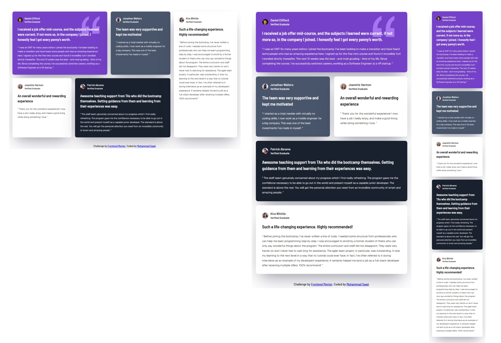

# Frontend Mentor - Testimonials grid section solution

This is a solution to the [Testimonials grid section challenge on Frontend Mentor](https://www.frontendmentor.io/challenges/testimonials-grid-section-Nnw6J7Un7). Frontend Mentor challenges help you improve your coding skills by building realistic projects.

## Table of contents

- [Overview](#overview)
  - [The challenge](#the-challenge)
  - [Screenshot](#screenshot)
  - [Links](#links)
- [My process](#my-process)
  - [Built with](#built-with)
  - [What I learned](#what-i-learned)
  - [Continued development](#continued-development)
  - [Useful resources](#useful-resources)
  - [AI Collaboration](#ai-collaboration)
- [Author](#author)

**Note: Delete this note and update the table of contents based on what sections you keep.**

## Overview

### The challenge

Users should be able to:

- View the optimal layout for the site depending on their device's screen size

### Screenshot



### Links

- Live Site URL: [click here](https://muhammad-saad311.github.io/FrontEnd-Mentor-Challenges/testimonials-grid-section-main/)

## My process

### Built with

- Semantic HTML5 markup
- CSS custom properties
- CSS Grid
- Mobile-first workflow

### What I learned

I learned and got a recap on the major concept of css grid which was mainly used in this challenge for ensuring reponsiveness. I also felt effectively handling the typography and colors.

Some of the important code sinppets where I think I did the best nad encouraged me are as follows

I positioned the quotation pattern using the background-image property and background-position property.

```
#testimonial-1{
        grid-column: 1/3;
        background-image: url('./images/bg-pattern-quotation.svg');
        background-position: 90% 10%;
        background-repeat: no-repeat;
    }
```

I control the reponsivenesst by applying media queries and changing the grid's layout.

```
@media screen and (min-width: 768px) {
    .testimonials-grid {
        grid-template-rows: repeat(3, auto);
        grid-template-columns: repeat(2, auto);
    }

    #testimonial-1{
        grid-column: 1/3;
        background-image: url('./images/bg-pattern-quotation.svg');
        background-position: 90% 10%;
        background-repeat: no-repeat;
    }
    #testimonial-4, #testimonial-5 {
        grid-column: 1/3;
    }
}
@media screen and (min-width: 1040px) {
    .testimonials-grid {
        grid-template-rows: repeat(2, auto);
        grid-template-columns: repeat(4, auto);
    }
    #testimonial-5{
        grid-column: 4/5;
        grid-row: 1/3;
    }
    #testimonial-4{
        grid-column: 2/4;
    }
    #testimonial-3{
        grid-column: 1/2;
    }
}
```

### Continued development

I would like to focus on the following areas of front end development

* JS DOM manipulation
* Advanced front end techniques
* Structurized styles and typography creation
* Animations

### Useful resources

- [Google Fonts](https://fonts.google.com/specimen/Barlow+Semi+Condensed) - This helped me access the recommended font

### AI Collaboration

I completed this challenge solely and got no AI assistance.

## Author

- Frontend Mentor - [@Muhammad-Saad311](https://www.frontendmentor.io/profile/Muhammad-Saad311)
